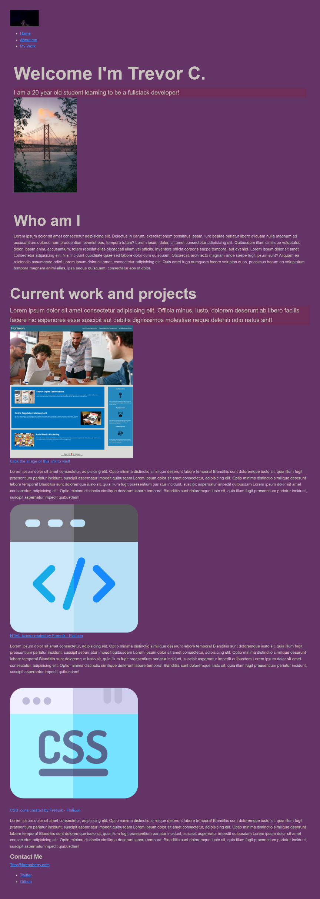

# portfolio-project

This website is my portolio that I made using the knowledge I have learned so far and help form various resourcesand classmates!

## Usage

This will be used to update the work I have done and will continue to be updated using the knowledge I continue to gain.

## Screenshot of Portfolio

## Link to website

https://esysis.github.io/portfolio-project/

## Credits

I want to give a big thanks to Kevin Powell over at [Scrimba](https://scrimba.com/learn/portfolio) and Franklin Li in my class for recommending the video Kevin made.